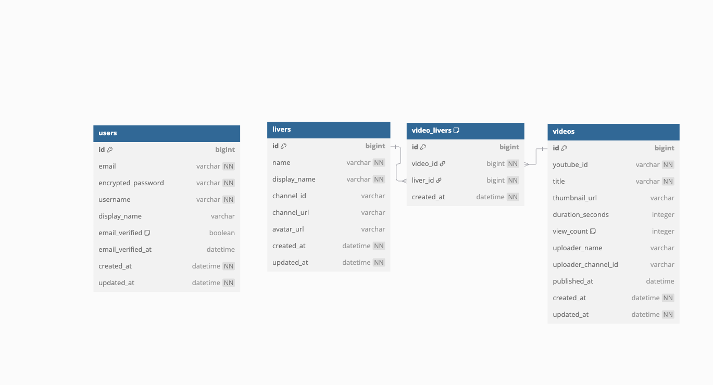

こんにちは

## サービスURL
https://vkiri-front.vercel.app/

■サービス概要
ぶいすぽっ！所属ライバーの切り抜き動画を専門的に収集・整理し、ファンが効率的に優良な切り抜きを発見できるプラットフォームです
Youtubeに散らばっている切り抜き動画を一元管理して、ライバー別・シーン別・人気別に整理して提供します

■ このサービスへの思い・作りたい理由
ぶいすぽっ！の切り抜きを探す際、毎回Youtubeで個別に検索しても、前に見た面白かった動画や、ぶいすぽっ！の魅力的なシーンをより多くの人に届けたいという思いから

■ ユーザー層について
メインターゲット：既存のぶいすぽっ！ファン
理由：
- 既にコンテンツへの愛着があり、より多くの切り抜きを効率的に消費したいニーズが高い
- 見ていないぶいすぽっ！メンバーを知るきっかけになる

■サービスの利用イメージ
トップページ
- いいね数の多い動画を並べる
検索ページ
- ぶいすぽっ！メンバーのボタン名をクリックしてそのメンバーの動画に遷移する

■ ユーザーの獲得について
- Twitter/Xでのぶいすぽっ！関連のハッシュタグでの情報発信
- SEO対策による「ぶいすぽっ！切り抜き」検索での上位表示

■ サービスの差別化ポイント・推しポイント
- ぶいすぽっ！に特化することで、より深いタグ付けと分類が可能

■ 機能候補
MVPリリース時
- [ ] 切り抜き動画一覧表示・検索機能
- [ ] webhookによるYoutube動画の取得
- [ ] ライバー別フィルタリング
- [ ] Youtube埋め込み再生
- [ ] 基本的な動画情報表示
- [ ] レスポンシブデザイン

本リリース
- [ ] Google登録機能
- [ ] お気に入り・視聴履歴
- [ ] タグシステム
- [ ] 人気ランキング

## ER図

# 画面構成図
https://v0.dev/chat/vtuber-video-editor-dctdG2OE1va

https://v0.dev/chat/vtuber-video-app-UzKu53HRY4H
